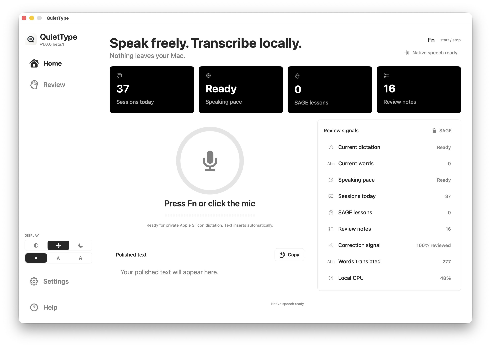
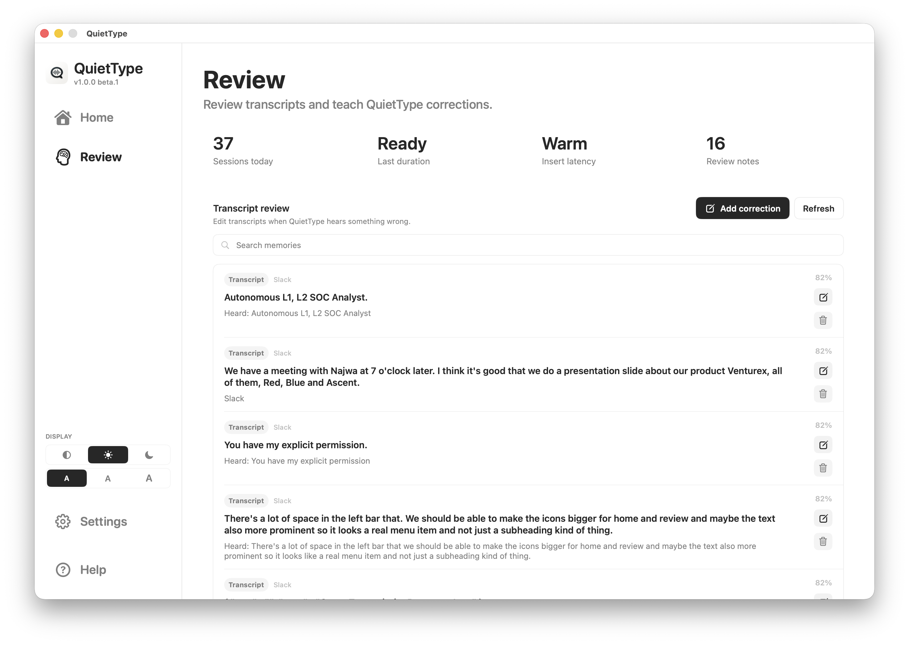
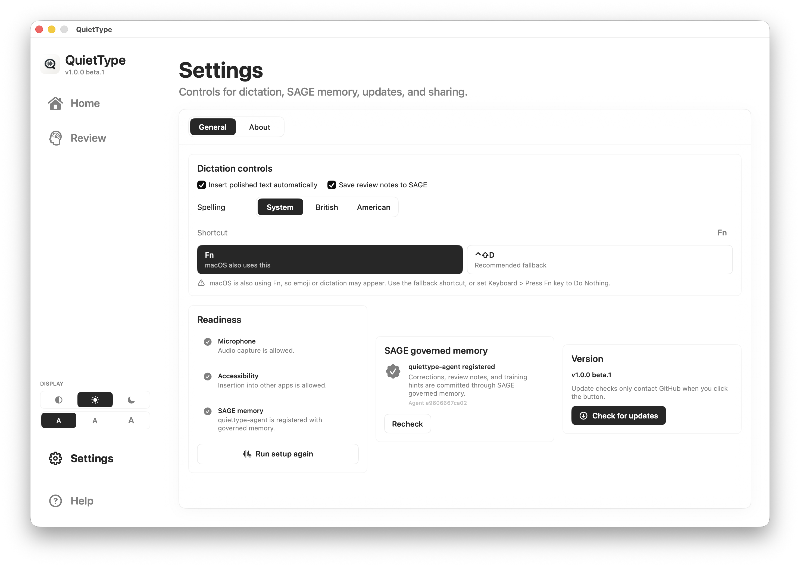
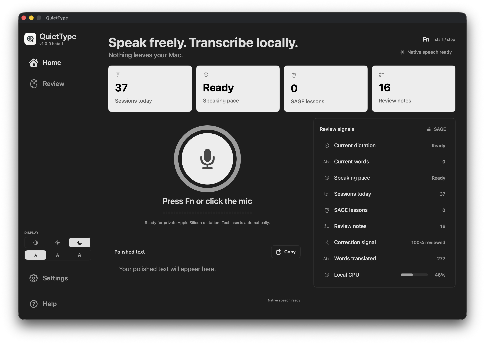

# QuietType

Native macOS dictation for AI prompts, everyday writing and desktop workflows.

QuietType turns natural speech into clean text wherever your cursor is focused:
ChatGPT, Claude, Codex, Cursor, email, WhatsApp, Slack, terminals, editors,
notes, docs and internal tools. It uses native Apple technology for capture,
permissions, insertion, Keychain storage and WhisperKit/Core ML transcription,
with no cloud processing path for normal dictation.

> Speak freely. Transcribe locally. Nothing leaves your Mac.



<p align="center">
  <a href="https://github.com/l33tdawg/quiettype/releases/download/v1.0.0-beta.6/QuietType-1.0.0-beta.6-macOS-arm64.dmg">
    
  </a>
</p>

## Why

AI tools work best when you give them rich context: what you want, what to
avoid, what examples matter and what output should look like. Everyday writing
has the same problem: email, chat replies, notes, tickets and docs are faster to
speak than type. Cloud dictation is fast, but it can expose exactly the material
builders, operators and teams care about: client context, unreleased plans,
private prompts, source paths, bug details, vocabulary and review notes.

QuietType is built for the opposite default:

- no cloud speech recognition
- no uploaded voice samples
- no uploaded transcripts
- no uploaded prompt text
- no remote LLM cleanup path
- no telemetry by default
- local ML transcription on Apple Silicon
- mandatory local SAGE governed memory for corrections, vocabulary and review notes

## Main Features

### Fast voice input wherever the cursor is focused

Use QuietType anywhere you can type:

- ChatGPT
- Claude
- Codex
- Cursor
- email
- WhatsApp
- Slack
- notes and docs
- VS Code
- terminals
- GitHub issues
- internal tools

The goal is not raw transcription. QuietType turns natural speech into usable
written text:

```text
natural speech
  -> streaming local ASR
  -> correction and vocabulary layer
  -> local semantic cleanup
  -> app-aware formatted text
  -> insertion into the active app
```

### Local-only speech processing

The beta bundles a local WhisperKit/Core ML speech model for Apple Silicon.
Normal dictation does not require OpenAI, Gemini, Anthropic or any hosted ASR
provider. The macOS app is native Swift/SwiftUI/AppKit, so microphone capture,
Accessibility insertion, hotkeys, Keychain-backed storage and model execution
stay aligned with Apple platform security.

### Governed local memory with SAGE

QuietType uses [SAGE](https://github.com/l33tdawg/sage) as the mandatory
BFT-governed local memory layer for preferred spellings, technical vocabulary,
correction patterns and dictation review notes. SAGE gives QuietType an
auditable memory substrate instead of a loose local notes file: memories are
governed, inspectable and designed for local-first AI and desktop workflows.

Learn more at the [SAGE public page](https://l33tdawg.github.io/sage/).

Beta builds are designed to bundle SAGE GUI so first-run setup can
start the local SAGE node without asking users to hunt for a separate download.
Release builds can pin a known-good SAGE GUI release to avoid version drift.

### Voice notes with editable local transcripts

Voice Notes is a separate local recording space for private thoughts, diary
entries, rough plans and long-form ideas. QuietType records the audio,
transcribes it locally, lets you edit both the raw transcript and polished note,
and stores the result on the Mac.

Voice note audio is encrypted at rest before it is written to disk. Transcript
edits live in QuietType's encrypted local memory store. New voice notes also
copy their transcript to SAGE by default so useful context can become governed
memory, but the audio file remains local and encrypted.

### Local personalization without cloud training

The setup flow asks users to read short scripts. QuietType uses those local
samples to improve cadence, vocabulary and spelling hints. Samples stay on the
user's machine.







### Mac-native workflow

- Fn-first global shortcut with a configurable fallback
- active-app insertion
- clipboard fallback
- microphone and Accessibility setup guidance
- setup progress and local activity status
- SAGE memory search/review UI for corrections, vocabulary and review notes
- encrypted Voice Notes with playback, transcript editing and optional SAGE transcript copies
- bundled SAGE GUI for first-run governed memory setup
- signed update checks with visible download/install status and restart flow
- signed beta DMG

## Privacy Model

QuietType is designed around a simple rule: private voice and prompt material
should not leave the Mac.

| Area | Default |
| --- | --- |
| Voice audio | Local only |
| Voice note audio | Encrypted local file |
| Voice training samples | Local only |
| Raw transcript text | Local only |
| Voice note transcripts | Encrypted local store; SAGE transcript copy on by default |
| Prompt cleanup | Local only |
| Vocabulary memory | Mandatory local SAGE memory |
| Correction/review notes | Mandatory local SAGE memory |
| Cloud fallback | None |

Network participation is not required for normal dictation. QuietType treats
SAGE as a local governed memory layer; dictation memories should remain
local-only unless the user explicitly changes a future SAGE network policy.

## Status

QuietType is in public beta for macOS Apple Silicon. The current public beta
ships as a signed Apple Silicon DMG through GitHub Releases.

Landing page target:

```text
https://l33tdawg.github.io/quiettype/
```

The GitHub Pages site lives in `docs/`.

Public releases:

```text
https://github.com/l33tdawg/quiettype/releases
```

The download badge and landing-page links point at the latest published GitHub
Release. Source on `main` may be ahead of the published beta while a new signed
DMG is being prepared.

## Development

See [docs/PRD.md](docs/PRD.md) for product requirements.
See [docs/dev-setup.md](docs/dev-setup.md) for local development setup.
See [docs/macos-signing.md](docs/macos-signing.md) for signing notes.
See [docs/beta-release.md](docs/beta-release.md) for local and GitHub Actions
release notes.

Run tests:

```bash
swift test
```

Try the core text pipeline:

```bash
swift run localtype "the sage benchmark needs to rerun the comet b f t latency numbers"
swift run localtype-session "ask codex to review the auth flow and preserve the ed twenty five five nineteen terminology"
```

## Author

QuietType is by Dhillon "l33tdawg" Kannabhiran.

Contact: [dhillon@levelupctf.com](mailto:dhillon@levelupctf.com)
