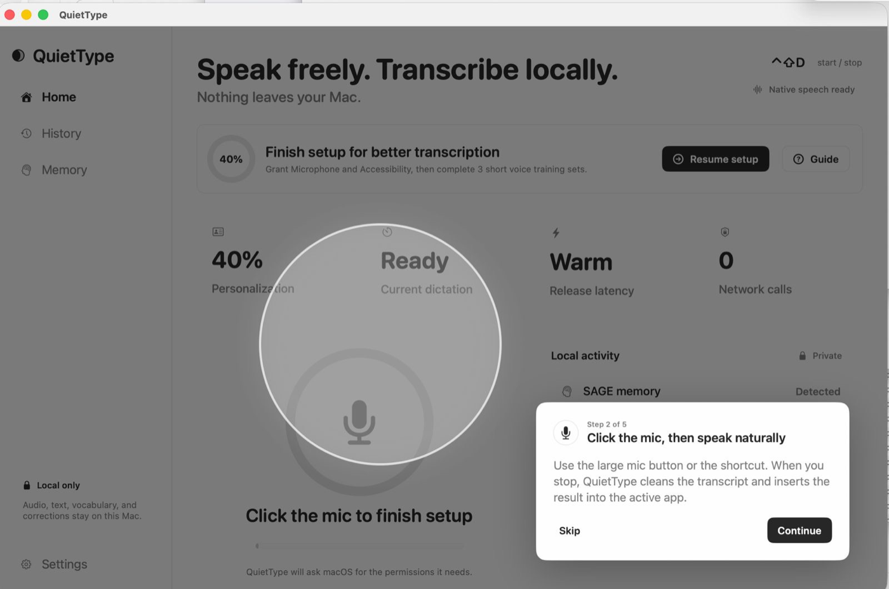
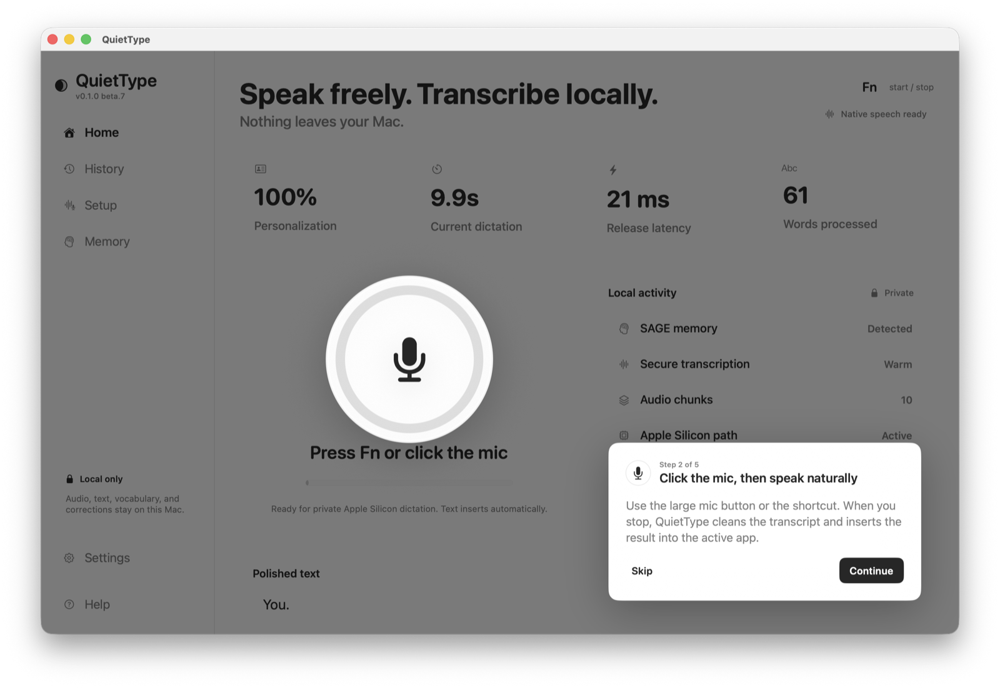

# QuietType

Native macOS dictation for coding agents and desktop workflows.

QuietType lets you talk to Codex, Claude Code, ChatGPT, Cursor, terminals,
editors, notes and email through local ML on your Mac. It uses native Apple
technology for capture, permissions, insertion, Keychain storage and
WhisperKit/Core ML transcription, with no cloud processing path for normal
dictation.

> Speak freely. Transcribe locally. Nothing leaves your Mac.



## Why

Coding agents work best when you give them rich context: what to inspect, what
to change, how to test it, what to avoid and what tradeoffs to explain. Typing
that much context is slow. Cloud dictation is fast, but it can expose exactly
the material builders and security teams care about: source paths, bug details,
client context, unreleased plans, private prompts, vocabulary and review notes.

QuietType is built for the opposite default:

- no cloud speech recognition
- no uploaded voice samples
- no uploaded transcripts
- no uploaded prompt text
- no remote LLM cleanup path
- no telemetry by default
- local ML transcription on Apple Silicon
- mandatory local SAGE governed memory for corrections, vocabulary and review notes

## Main Features

### Fast voice input for agents and desktop workflows

Use QuietType anywhere you can type:

- Codex
- Claude Code
- ChatGPT
- Cursor
- VS Code
- terminals
- GitHub issues
- Slack and email
- notes and docs

The goal is not literal transcription. QuietType turns natural speech into
usable written instructions:

```text
natural speech
  -> streaming local ASR
  -> correction and vocabulary layer
  -> local semantic cleanup
  -> app-aware formatted text
  -> insertion into the active app
```

### Local-only speech processing

The beta bundles a local WhisperKit/Core ML speech model for Apple Silicon.
Normal dictation does not require OpenAI, Gemini, Anthropic or any hosted ASR
provider. The macOS app is native Swift/SwiftUI/AppKit, so microphone capture,
Accessibility insertion, hotkeys, Keychain-backed storage and model execution
stay aligned with Apple platform security.

### Governed local memory with SAGE

QuietType uses [SAGE](https://github.com/l33tdawg/sage) as the mandatory
BFT-governed local memory layer for preferred spellings, technical vocabulary,
correction patterns and dictation review notes. SAGE gives QuietType an
auditable memory substrate instead of a loose local notes file: memories are
governed, inspectable and designed for local-first agent workflows.

Learn more at the [SAGE public page](https://l33tdawg.github.io/sage/).

Private beta builds are designed to bundle SAGE GUI so first-run setup can
start the local SAGE node without asking users to hunt for a separate download.
Release builds can pin a known-good SAGE GUI release to avoid version drift.

### Local personalization without cloud training

The setup flow asks users to read short scripts. QuietType uses those local
samples to improve cadence, vocabulary and spelling hints. Samples stay on the
user's machine.



### Mac-native workflow

- Fn-first global shortcut with a configurable fallback
- active-app insertion
- clipboard fallback
- microphone and Accessibility setup guidance
- setup progress and local activity status
- SAGE memory search/review UI for corrections, vocabulary and review notes
- bundled SAGE GUI for first-run governed memory setup
- signed and notarized beta DMG

## Privacy Model

QuietType is designed around a simple rule: private voice and prompt material
should not leave the Mac.

| Area | Default |
| --- | --- |
| Voice audio | Local only |
| Voice training samples | Local only |
| Raw transcript text | Local only |
| Prompt cleanup | Local only |
| Vocabulary memory | Mandatory local SAGE memory |
| Correction/review notes | Mandatory local SAGE memory |
| Cloud fallback | None |

Network participation is not required for normal dictation. QuietType treats
SAGE as a local governed memory layer; dictation memories should remain
local-only unless the user explicitly changes a future SAGE network policy.

## Status

QuietType is in private beta for macOS Apple Silicon. The repository will remain
private until the 1.0 beta milestone, after a few more hardening releases around
setup, permissions, memory review, packaging and accuracy.

Landing page target:

```text
https://l33tdawg.github.io/quiettype/
```

The GitHub Pages site is ready in `docs/` and should be enabled when the repo
goes public for the 1.0 beta launch.

Private releases:

```text
https://github.com/l33tdawg/quiettype/releases
```

## Development

See [docs/PRD.md](docs/PRD.md) for product requirements.
See [docs/dev-setup.md](docs/dev-setup.md) for local development setup.
See [docs/macos-signing.md](docs/macos-signing.md) for signing notes.
See [docs/beta-release.md](docs/beta-release.md) for local and GitHub Actions
release notes.

Run tests:

```bash
swift test
```

Try the core text pipeline:

```bash
swift run localtype "the sage benchmark needs to rerun the comet b f t latency numbers"
swift run localtype-session "ask codex to review the auth flow and preserve the ed twenty five five nineteen terminology"
```

## Author

QuietType is by Dhillon "l33tdawg" Kannabhiran.

Contact: [dhillon@levelupctf.com](mailto:dhillon@levelupctf.com)
